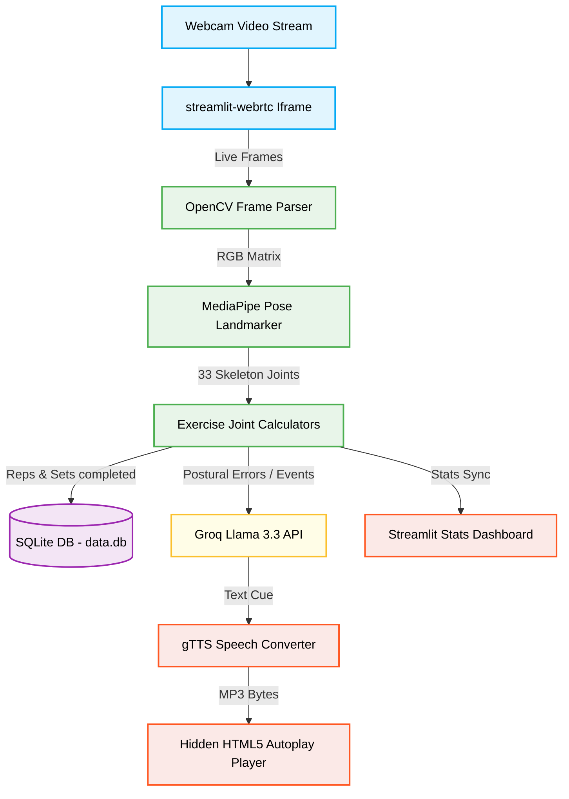

# 🏋️‍♂️ AI Real-time GYM Coach - Blueprint & Roadmap

This document outlines **how to use** the application, provides a **color-coded architecture block diagram**, lists **current features**, and highlights the **future scope & roadmap** for production-level development.

---

## 📖 How to Use the Application (Step-by-Step)

Follow these steps to operate the app locally:

1. **User Onboarding**:
   * Open the app. You will see the **Login Wall**.
   * Enter a unique username (e.g., `princekhunt`) and click **Start Session**.
2. **Configure Workout Plan**:
   * Go to the **Sidebar** (`Apna AI Coach`).
   * Select your exercise (e.g., `Squats`, `Push-ups`, `Lunges`).
   * Enter the number of **Sets** and **Reps per Set**.
   * Click the **Start Workout** button.
3. **Camera & AI Coaching**:
   * Grant webcam access when prompted.
   * Click **Start** on the WebRTC camera widget to start streaming.
   * Reposition your body so you are fully visible in the camera frame.
   * Start performing the selected exercise. The AI coach will count your reps and speak live postural corrections (e.g., *"Keep your back straight!"*).
4. **Workout Summary**:
   * Once you finish your target sets, click **End Workout**.
   * Scroll down to view the **Workout History** table summarizing your exercise, total reps, sets completed, duration (sec), and date.

---

## 🎨 System Flow & Block Diagram

Here is the system architecture. Nodes are color-coded based on their functional roles:
* 🟢 **Green (Input/Client Side)**: Captures user interaction and webcam video.
* 🔵 **Blue (Core Posture Engine)**: Calculates joints, coordinates, and angles.
* 🟣 **Purple (Persistence)**: Saves history to the database.
* 🟡 **Yellow (AI Brain)**: Generates coaching cues.
* 🔴 **Orange (Output)**: Speaks and displays updates.

---

## 🌟 Current Features

| Feature | Description | Business Value |
| :--- | :--- | :--- |
| **Real-time Skeleton Tracking** | Detects 33 human joint coordinates dynamically. | Users receive visual confirmation of tracking status. |
| **Multi-exercise Support** | Tracks Squats, Push-ups, Biceps Curls, Shoulder Presses, and Lunges. | Provides a versatile routine for full-body workouts. |
| **State-Machine Counter** | Counts repetitions accurately by detecting state changes (e.g., going UP vs DOWN). | Users don't have to keep count, letting them focus on form. |
| **Postural Error Correction** | Identifies knee bends, hip sags, elbow drifts, and torso swings. | Reduces the risk of workout-related injuries. |
| **AI Voice Coach** | Speaks corrective advice aloud in real-time. | Emulates a real personal trainer's presence. |
| **Workout Logs** | Logs complete stats locally on a SQLite table. | Helps users track history and incremental progress. |

---

## 🚀 Future Scope & Enhancements (Roadmap)

To elevate this project to a production-grade startup application, the following features can be added:

### 1. Advanced Authentication & Cloud Sync
* **What**: Replace SQLite with a cloud-managed service (like **Supabase** or **Firebase**), adding email/Google login.
* **Why**: Saves users' progress across multiple devices (mobile, laptop) instead of locking data to a single local file.

### 2. Custom AI Workout Planner
* **What**: Integrate a profiling questionnaire (age, weight, goal: bulk/cut) and use Llama 3.3 to auto-generate weekly sets, reps, and exercise plans.
* **Why**: Transforms the app from a simple pose tracker into a comprehensive digital wellness planner.

### 3. Gamification, Streaks & Leaderboards
* **What**: Introduce a points system (XP per rep), virtual badges, and a leaderboard where friends can view each other's weekly workout metrics.
* **Why**: Drastically improves user retention and user engagement through friendly competition.

### 4. Client-side WebAssembly Pose Processing
* **What**: Port the MediaPipe model to run directly in the user's browser using JavaScript / WebAssembly instead of passing raw video frames to Python.
* **Why**: Reduces server hosting costs to almost $0 since frame processing happens on the client's device, enabling the app to scale to millions of users smoothly.

### 5. Wearables & Heart Rate Sync
* **What**: Integrate APIs for Apple Watch, Fitbit, or Garmin to capture live heart rate and calorie burn data alongside posture metrics.
* **Why**: Provides deep biological insights, warning users if their heart rate goes too high during intensive sets.
