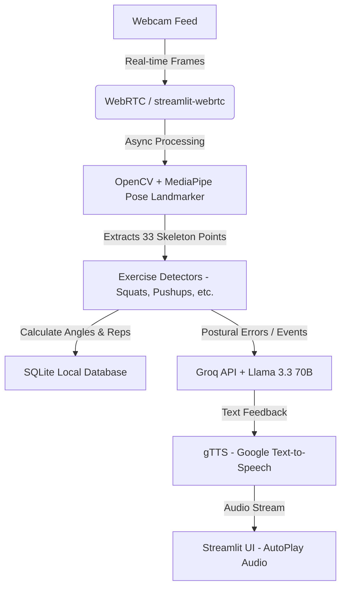

# 🏋️‍♂️ AI Real-time GYM Coach - Tech Stack & Interview Guide

This guide breaks down the architecture, technical choices, and interview preparation for the **AI Real-time GYM Coach** project. Written in a friendly, easy-to-understand Hinglish format with real-world analogies.

---

## 🏗️ Technical Architecture Overview

Before diving into individual technologies, let's look at the flow of data:


---

## 🛠️ The Tech Stack (What, Why, Alternatives & Analogies)

### 1. Streamlit (Frontend & Backend Glue)
* **What**: Ek open-source Python framework hai jo data science aur AI projects ko quickly interactive web apps mein convert karne mein madad karta hai.
* **Why**: Project ko separate HTML, CSS, React frontend aur Python backend mein divide karne ke bajay, Streamlit poora application single Python script (`main.py`) mein run karne ki facility deta hai. Isse local prototyping aur session state management extreme fast ho jata hai.
* **Alternatives**: React.js / Next.js (Frontend) + FastAPI / Flask (Backend).
* **Analogy (Kuchh Aise Samjho)**: Streamlit ek **"Ready-made Buffet"** ki tarah hai. Aapko tables set nahi karni, plate aur cutlery design nahi karni; bas items choose karke display par rakh dena hai. Jabki React + FastAPI ek **"Custom Kitchen"** ki tarah hai, jahan aapko raw ingredients laakar, bartan dhokar, table aur chair khareed kar, khud zero se plate design karni padti hai.

---

### 2. Streamlit-webrtc (Real-Time Video Streaming)
* **What**: Streamlit ka ek extension custom component jo browser ke webcam streams ko directly server-side Python environment mein low-latency streaming pipeline ke zariye connect karta hai.
* **Why**: Streamlit synchronous execution par kaam karta hai (poora code bar-bar rerun hota hai). Standard Streamlit tools live camera streams ko bina block kiye handle nahi kar sakte. `streamlit-webrtc` camera streaming ko background async thread mein chalata hai taaki video smoothly (30 FPS) render ho bina frontend ko freeze kiye.
* **Alternatives**: WebSockets (using Socket.io) ya HTTP Multipart stream.
* **Analogy (Kuchh Aise Samjho)**: `streamlit-webrtc` ek **"Live Walkie-Talkie Call"** hai. Dono side ke log real-time bina kisi lag ke ek doosre ki aawaz aur visual data exchange kar rahe hain. Aur WebSockets ya standard HTTP polling **"WhatsApp Voice Notes/Images"** bhejne ki tarah hai—ek ek karke upload hoga, server par jayega, process hoga aur phir response aayega.

---

### 3. MediaPipe Pose Landmarker (Pose Estimation Engine)
* **What**: Google ke dwara banaya gaya ek machine learning framework jo video ya images se human body ke **33 skeleton landmarks** (points like shoulder, elbow, wrist, hip, knee, ankle) ko real-time mein track karta hai.
* **Why**: Yeh CPU aur lightweight GPUs par chalne ke liye optimized hai. Hamein pure deep learning models ko raw train karne ki zaroorat nahi hai. MediaPipe instantly exact x, y, z coordinates de deta hai jisse hum elbow, knee aur back ke angles calculate kar lete hain.
* **Alternatives**: YOLOv8-Pose (Heavy and needs GPU), OpenPose (Complex setup).
* **Analogy (Kuchh Aise Samjho)**: MediaPipe ek **"Virtual Tailor (Darzi)"** hai. Jaise hi aap camera ke samne aate hain, woh tape measure lekar instant aapke body joints (knees, hips, elbows) par 33 markers laga deta hai aur coordinate values note karta rehta hai.

---

### 4. OpenCV (Image & Frame Processing)
* **What**: Open-source Computer Vision library jo images aur video frames ko resize, flip, color conversion aur visual overlays draw karne mein kaam aati hai.
* **Why**: Video stream se raw frames ko retrieve karke, unhe BGR format se RGB (MediaPipe compatible) mein badalne aur output frame par skeleton (green lines) aur metrics overlay (visual text) draw karne ke liye OpenCV ka use hota hai.
* **Alternatives**: Pillow (PIL), scikit-image.
* **Analogy (Kuchh Aise Samjho)**: OpenCV ek **"Live Video Editor"** ki tarah hai. Jaise hi live footage aati hai, woh piche se frames ko mirror flip karta hai, screen ke niche "DEPTH: GOOD" likhta hai, aur bones par skeleton draw karta hai taaki screen attractive aur informative lage.

---

### 5. Groq API & Llama 3.3 70B (AI Coach Brain)
* **What**: Groq ek ultra-fast hardware inference platform hai jo LPU (Language Processing Unit) ka use karta hai. Llama 3.3 70B ek state-of-the-art open large language model hai.
* **Why**: Gym mein real-time feedback chahiye hota hai. Agar AI 5 second baad batayega ki "Knees bend karo," toh user tab tak injury kar chuka hoga. Groq Llama 3.3 ko ultra-fast speeds (>500 tokens/sec) par run karta hai, jisse milliseconds mein concise feedback (cues) milta hai.
* **Alternatives**: OpenAI GPT-4o API (Slower and costly), Gemini API, local llama-cpp (Runs too slow on normal PCs).
* **Analogy (Kuchh Aise Samjho)**: Groq ek **"Super-fast Sports Car"** hai jo instantly user ko destination par drop karti hai, jabki baaki LLM APIs **"City Buses"** ki tarah hain jo traffic/network latency mein fansi rehti hain.

---

### 6. gTTS (Google Text-To-Speech)
* **What**: Google ka ek simple Python wrapper library jo text input ko natural-sounding MP3 speech audio bytes mein convert karta hai.
* **Why**: Proactive coaching ko voice-based banana tha. Groq se mili AI response text ko gTTS audio format (.mp3) mein convert karta hai aur `st.audio(..., autoplay=True)` ke through user ko sunata hai.
* **Alternatives**: ElevenLabs (Paid), pyttsx3 (Offline but robot-like voice quality).
* **Analogy (Kuchh Aise Samjho)**: gTTS ek **"Voice Artist"** ki tarah hai jo paper par likhe cues ko quickly mic mein speak karke player ko real-time audio sunata hai.

---

### 7. SQLite (Local Persistence)
* **What**: Ek lightweight, serverless, file-based relational database management system.
* **Why**: Workout progress, total sets aur completed reps ko history page par save karne ke liye humein kisi server setup (like PostgreSQL/MongoDB) ki zaroorat nahi thi. SQLite data ko project folder ke andar `data.db` file mein save kar deta hai jo local run ke liye perfect hai.
* **Alternatives**: PostgreSQL, MySQL, MongoDB.
* **Analogy (Kuchh Aise Samjho)**: SQLite ek **"Pocket Diary"** ki tarah hai jo hum direct drawer mein rakh dete hain aur likhte hain. PostgreSQL ek **"Government Archives Office"** ki tarah hai jiske paas jaane ke liye security clearances, network address aur permissions chahiye hoti hain.

---

## 💬 Interview Cross-Questions & Answers (Tough Scenarios)

### Q1: Streamlit single-threaded execution structure use karta hai (reruns on state changes). WebRTC 30 FPS par video frames bhejta hai. Hamein frame rendering mein block hone se bachne ke liye code ko kaise sync kiya?
* **Answer**: We used an **asynchronous producer-consumer pattern with locks**. `streamlit-webrtc` handles frame processing in a separate background OS thread. Inside `VideoProcessorClass`, we override the `recv(self, frame)` method. The detection runs on this worker thread and writes latest metrics to `self._latest_metrics` inside a thread `threading.Lock()`. The main Streamlit thread periodically calls `get_latest_metrics()` (using the lock) and updates the session state UI. This ensures the heavy AI computation does not freeze the camera screen.
* **Analogy**: Yes jaise **"Resturant Ke Kitchen aur Waiter"** ki tarah kaam karta hai. Kitchen (Background WebRTC Thread) continuously khana bana raha hai bina kisi delay ke. Waiter (Main Streamlit Thread) beech-beech mein counter par jaakar status check karta hai aur customer ki table (UI screen) update kar deta hai. Waiter kitchen ke andar khade hokar frame by frame wait nahi karta.

---

### Q2: MediaPipe Pose Landmarker use karte waqt Camera Frame Coordinates (Normalized 0 to 1) ko real-time angle calculation mein kaise convert kiya? Trigonometry formula kya lagaya?
* **Answer**: MediaPipe returns coordinates normalized between `0.0` and `1.0`. We extract three joints (e.g., Shoulder, Elbow, Wrist for Curl). We convert them back using vector trigonometry. We calculate vectors $AB$ and $CB$ where $B$ is the vertex joint (Elbow):
  $$\vec{BA} = (a_x - b_x, a_y - b_y)$$
  $$\vec{BC} = (c_x - b_x, c_y - b_y)$$
  Then we use the Dot Product formula to find the Cosine of the angle:
  $$\cos(\theta) = \frac{\vec{BA} \cdot \vec{BC}}{\|\vec{BA}\| \times \|\vec{BC}\|}$$
  And use `math.acos` to calculate the final angle in degrees.
* **Analogy**: Jaise hum **"Protracter (D-Scale)"** se paper par angle naapte hain—humein baseline aur terminal line ke intersection coordinate point (elbow) ki coordinate values pata honi chahiye, bas yahan wahi logic mathematical vectors ke through software calculation mein kiya hai.

---

### Q3: Groq LLM API voice pipeline mein trigger hone par browser dynamically live audio playback kaise handle karta hai without refreshing the whole page?
* **Answer**: We use HTML/CSS injection with Streamlit components. In `main.py`, if `st.session_state.audio_to_play` contains bytes, we call `autoplay_audio(audio_bytes)` which writes:
  ```python
  st.markdown("<style>[data-testid='stAudio'] {display: none;}</style>", unsafe_allow_html=True)
  st.audio(audio_bytes, format="audio/mp3", autoplay=True)
  ```
  We hide the default HTML5 audio player widget using CSS (`display: none`), while using Streamlit's `autoplay=True` parameter to trigger instant background audio playback in the browser.
* **Analogy**: Yeh ek **"Background Speaker system in a Mall"** jaisa hai. Speakers deewar ke peeche chhupe hain (CSS `display: none`), aur announcements (audio feedback) achanak bajne lagte hain bina customer ko speaker setup dikhaye.

---

### Q4: Database connectivity mein SQL injection ya Thread Conflict ko avoid karne ke liye sqlite3.connect parameters ko kaise modify kiya?
* **Answer**: Since Streamlit is multi-threaded (separate connection threads for each session), sqlite3 by default raises `ProgrammingError: Database opened in a different thread`. We resolved this using:
  ```python
  sqlite3.connect(_DB_PATH, check_same_thread=False)
  ```
  We also decorated our connection pool function with `@st.cache_resource` to share the connection safely across different user actions.
* **Analogy**: Jaise ek **"Drinking Water Cooler"** shared office space mein lagaya ho. `check_same_thread=False` pipe connections ko allow karta hai taaki multiple employees (worker threads) ek hi system se paani peein bina multiple coolers lagaye.

---

### Q5: Posture checks real-time mein continuous triggers bhejte hain. LLM Coach baar-baar call hone se API limits exhaust ho sakti hain. Rate-limiting logic kya use kiya?
* **Answer**: We implemented a duration throttle threshold in `voice_pipeline.py`. Inside `process_event`, it tracks the Unix timestamp of the last successful feedback in `self.last_spoken_at`. If `event` is not a major milestone (like starting/ending workout), it checks if `current_time - self.last_spoken_at < 5` seconds. If true, it returns `None` immediately, bypassing the LLM API call.
* **Analogy**: Yeh bilkul ek **"Patience Filter (Dhairy)"** jaisa hai. Coach har sec camera dekh kar chilayega nahi. Woh error dekh kar minimum 5 seconds ka time dega user ko balance theek karne ke liye, uske baad hi dobara feedback dega.
